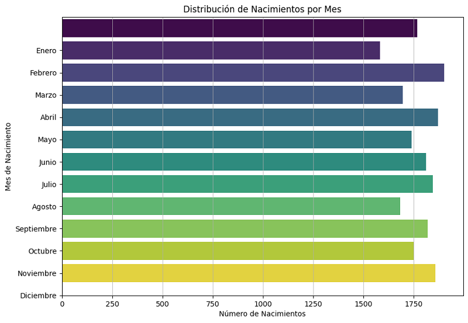

# Practice Cases

### Birth distribution / year (histogram)

### Birth distribution / month (horizontal bars)

### Birth distribution / year / month (sub plots)

### Distribution deaths age locality top n

---
